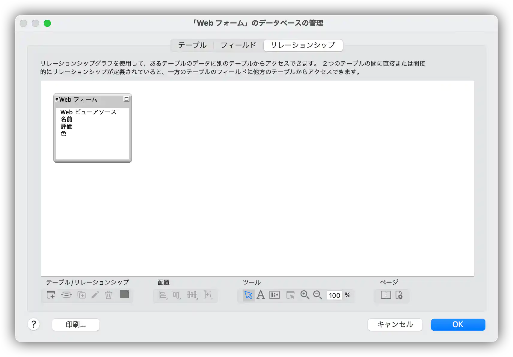

# filemaker-help-scripting-javascript-in-web-viewers

## 解説記事

- [パフォーマンス改善テクニック(FileMaker WebDirect と Web ビューア)を読んで、ヘルプの重要性を再確認した話 | フルーデンス](https://frudens.jp/read-filemaker-webdirect-and-webviewer-in-performance_tuning_techniques-pdf/)
- https://frudens.jp/read-filemaker-webdirect-and-webviewer-in-performance_tuning_techniques-pdf/

## 該当のヘルプ

- [Web ビューアで JavaScript を使用したスクリプト作成 | Claris Pro および FileMaker Pro ヘルプ](https://help.claris.com/ja/pro-help/content/scripting-javascript-in-web-viewers.html)

## アカウント情報

- アカウント名： `administrator`
- パスワード： `administrator`

## YouTube

### FileMakerのヘルプの通りに実装したアプリで JavaScript と Webビューア の連携（FileMaker Pro 編）

### FileMakerのヘルプの通りに実装したアプリで JavaScript と Webビューア の連携（WebDirect 編）

## スクリーンショット

